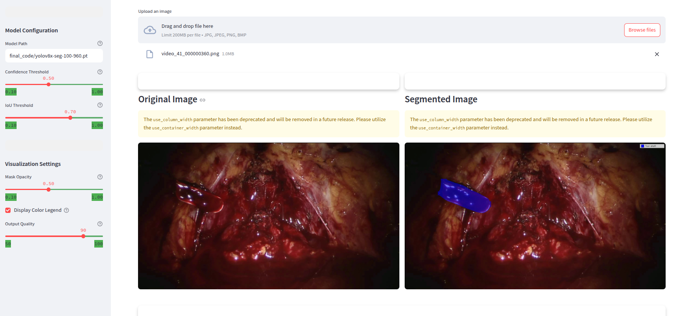
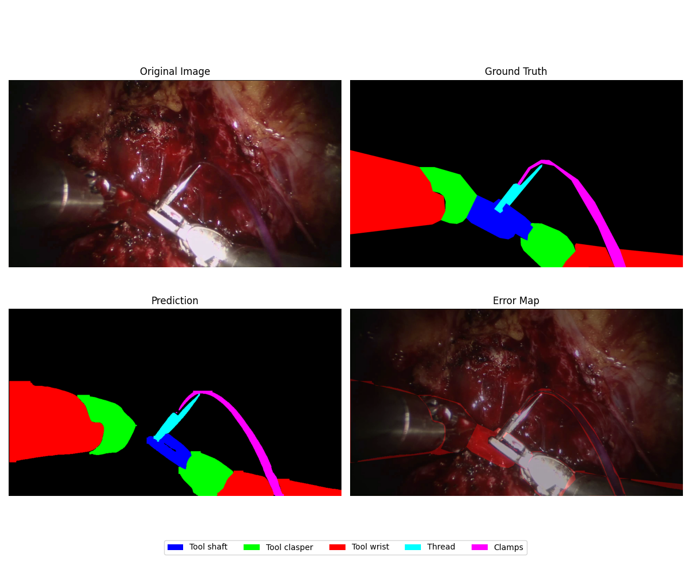

# SAR-RARP50-seg


## Overview

This project leverages the YOLOv8 segmentation model (xlarge variant) for high-precision semantic segmentation tasks on the SAR-RARP50 dataset. It enables accurate identification and delineation of surgical instruments and anatomical structures in robotic surgery imagery.

## Installation

```bash
# Clone the repository
git clone https://github.com/MahdiMohseni0033/SAR-RARP50-seg.git

# Navigate to project directory
cd SAR-RARP50-seg

# Create and activate Conda environment
conda create -n yolo-sar python=3.11 -y
conda activate yolo-sar

# Install dependencies
pip install -r requirements.txt
```

## Dataset Preparation

### Training Dataset
```bash
bash prepare_data.sh train
```
- Downloads the training dataset
- Processes and splits into training/validation sets
- Converts to YOLO format
- Stores in `yolo_dataset2` directory

### Testing Dataset
```bash
bash prepare_data.sh test
```
- Downloads the testing dataset
- Processes the data
- Converts to YOLO format
- Stores in `yolo_test_set` directory

## Project Components

### Huggingface Repository Manager

A command-line utility designed for seamless management of Huggingface repositories.

**Location**: [Huggingface_repo_manager/](Huggingface_repo_manager/)

**Key Features**:
- Upload local files to Huggingface
- Delete files with built-in safeguards
- View repository metadata
- Browse files with tree visualization

For detailed usage information, see the [component README](Huggingface_repo_manager/README.md).

### YOLOv8 Segmentation Evaluator

`yolov8_seg_evaluator.py` provides comprehensive evaluation of YOLOv8 segmentation models on test datasets. The tool calculates key metrics including IoU, Dice coefficient, pixel accuracy, and mAP while handling class imbalance.

**Features**:
- Processes YOLO format test data (images + text labels)
- Calculates per-class and weighted metrics
- Generates visualization plots (PR curves, confusion matrix, etc.)
- Exports results as CSV files for further analysis
- Handles unbalanced class distributions

**Usage**:
```bash
python scripts/yolov8_seg_evaluator.py --model path/to/model.pt --img-dir path/to/images --label-dir path/to/labels
```

**Arguments**:
- `--model`: Path to your YOLOv8 model file
- `--img-dir`: Directory containing test images
- `--label-dir`: Directory containing YOLO format label files
- `--num-classes`: Number of segmentation classes (default: 9)
- `--save-dir`: Directory to save evaluation results (default: 'evaluation_results')

**Output**:
The tool generates metrics CSV files and visualization plots in the specified output directory.

### YOLOv8 Segmentation Video Inference

`yolo_video_inference.py` processes videos using a trained YOLOv8 segmentation model, overlaying colored masks for each detected class and adding a visual legend.

**Features**:
- Processes video files with YOLOv8 segmentation models
- Overlays semi-transparent colored masks for each detected object
- Displays a color-coded legend showing all 9 surgical tool classes
- Shows real-time processing statistics (FPS, frame count)
- Optimized for surgical tool segmentation with distinct colors for easy identification

**Usage**:
```bash
python scripts/yolo_video_inference.py --model path/to/model.pt --video path/to/input.mp4 --output path/to/output.mp4
```

**Arguments**:
- `--model`: Path to your YOLOv8 segmentation model
- `--video`: Path to input video file
- `--output`: Path for output video (default: 'output_video.mp4')
- `--conf`: Confidence threshold for detections (default: 0.3)

**Output**:
The script generates a video with colored segmentation masks and a class legend in the corner.

Example: [Watch Sample Output Video](assets/output.mp4)

### YOLOv8 Segmentation Image Processor

`yolo_image_inference.py` processes images using a trained YOLOv8 segmentation model, overlaying colored masks and creating a visual color legend for easy class identification.

**Features**:
- Processes single images or entire directories
- Overlays semi-transparent colored masks for each detected object
- Displays a comprehensive color-coded legend for all 9 surgical tool classes
- Adds contour outlines for better boundary visualization
- Supports multiple image formats (JPG, PNG, BMP)

**Usage**:

For a single image:
```bash
python scripts/yolo_image_inference.py --model path/to/model.pt --image path/to/image.jpg --output path/to/output.jpg
```

For a directory of images:
```bash
python scripts/yolo_image_inference.py --model path/to/model.pt --dir path/to/images --output path/to/output_dir
```

**Arguments**:
- `--model`: Path to your YOLOv8 segmentation model
- `--image`: Path to input image (use this OR --dir)
- `--dir`: Path to directory containing images (use this OR --image)
- `--output`: Path for output image or directory (optional)
- `--conf`: Confidence threshold for detections (default: 0.3)

**Output**:
The script generates images with colored segmentation masks and a legend in the top corner.

### Streamlit UI

**Installation**:
```bash
git lfs install
git clone https://huggingface.co/Mahdimohseni0333/SAR-RARP50
```

**Running the app**:
```bash
streamlit run streamlit_app.py
```

In this UI, you can set the path of the model and upload your image or video for inference.



### Evaluation Code

```bash
python scripts/yolov8_seg_evaluator.py --model_path <path_of_model> \
                               --image_dir <path_of_img_folder> \
                               --label_dir <path_of_labels_folder> \
                               --output_dir <path_of_foler_result> 
```

An example image demonstrating the segmentation results during evaluation:
